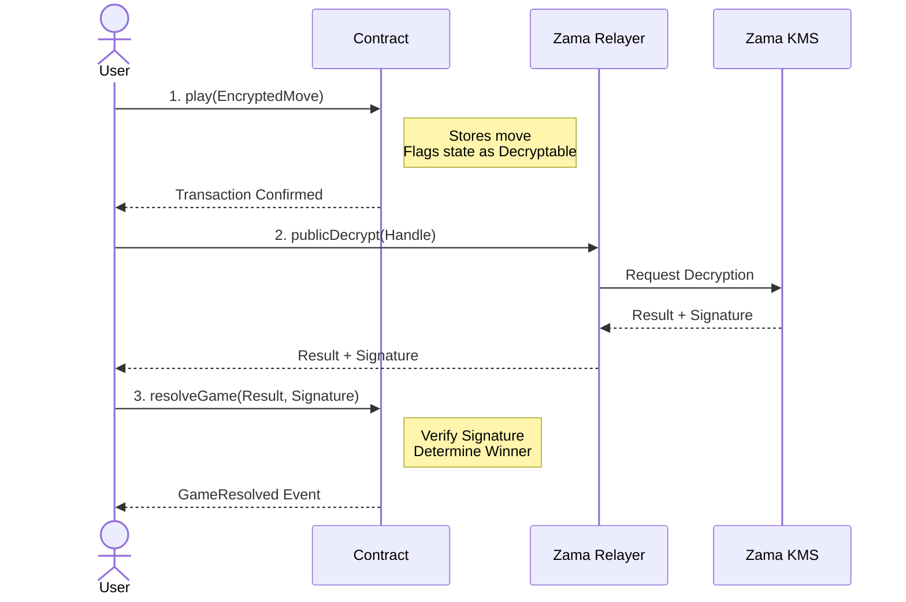

# Encrypted Rock-Paper-Scissors (FHEVM)

A confidential, verifiable Rock-Paper-Scissors game built on the [Zama fhEVM](https://docs.zama.ai/fhevm). This project demonstrates how to build privacy-preserving dApps where game logic executes over encrypted data, revealing only the final outcome.

It serves as a reference implementation for **FHEVM v0.9 Self-Relayed Decryption** and **EIP-1167 Proxy Patterns** with encrypted state.

## Features

  * **Confidentiality:** Players' moves are encrypted using Fully Homomorphic Encryption (FHE). The contract never sees the raw inputs.
  * **Fairness:** Game logic executes blindly on-chain.
  * **Gas Efficiency:** Uses a `uint8` bitmask architecture to pack game state into a single encrypted storage slot.
  * **Proxy Pattern:** Implements EIP-1167 Clones via a Factory (`RPSClub`) for cheap game instantiation.
  * **Self-Relayed Decryption:** Implements the v0.9 FHEVM architecture where the client handles the decryption workflow via the Zama SDK.
  * **PvC Mode:** Supports single-player mode driven by encrypted on-chain randomness.

## Quick Start

### Prerequisites

  - **Node.js**: Version 20 or higher
  - **pnpm** (recommended) or npm
  - **Sepolia ETH:** For deployment.

### Installation

1.  **Install dependencies**

    ```bash
    pnpm install
    ```

2.  **Set up environment variables**
  ```bash
    npx hardhat vars set ETHERSCAN_API_KEY
    npx hardhat vars set MNEMONIC
    npx hardhat vars set INFURA_API_KEY
  ```


3.  **Compile**

    ```bash
    npx hardhat compile
    ```

## 🕹️ How to Play (CLI)

This project includes custom Hardhat Tasks to simulate a full game loop from the CLI. These tasks handle the encryption, move submission, and the v0.9 self-relay decryption flow.

### 1. Deploy the Game Factory

First, deploy the logic contract and the factory to Sepolia.

```bash
npx hardhat deploy --network sepolia
```

### 2. Create a Game

To play against the AI (PvC mode), use the zero address (`0x00...00`) as the opponent.

```bash
npx hardhat rps:create --network sepolia --opponent 0x0000000000000000000000000000000000000000
```

*Copy the `Game Address` returned by this command.*

### 3. Submit Move (Player 1)

Encrypts and submits your move. Valid moves are `ROCK`, `PAPER`, or `SCISSORS`.

```bash
# Replace with your Game Address
npx hardhat rps:play --network sepolia --game 0xYourGameAddress --move ROCK
```

*Note: Since you are playing against the AI, the contract will automatically generate the opponent's move in the same transaction.*

### 4. Resolve Game (The Reveal)

This task fetches the encrypted state, requests decryption from the Zama KMS via the Relayer SDK, and submits the proof on-chain to finalize the winner.

```bash
npx hardhat rps:resolve --network sepolia --game 0xYourGameAddress
```

## 🧪 Testing

We use the `fhevm` mock environment for unit testing to ensure logic correctness without waiting for block confirmations.

```bash
npx hardhat test
```

## 🛠️ Developer Integration Guide

To integrate the Rock-Paper-Scissors game into your own project, interact with the `RPSClub` factory contract.

### On-Chain Integration (Solidity)

Here is how another smart contract can create a new game instance for two of its users.

```solidity
import { RPSClub } from "./RPSClub.sol";

contract MyGameHub {
    RPSClub rpsClub;

    constructor(address _rpsClubAddress) {
        rpsClub = RPSClub(_rpsClubAddress);
    }

    function startRpsMatch(address player1, address player2) external {
        // The RPSClub contract creates a new game clone
        // and emits a `GameCreated(address instance, ...)` event.
        // Your application can listen for this event to get the new game's address.
        rpsClub.createGame(player1, player2);
    }
}
```

You can also use callback from `RPS.sol` to handle the game outcomes: 
```solidity
interface IResultCallback {
    function RPSContractCallback(address winner, uint8 endState) external;

```
Implementation for this is shown at `RPSClub.sol`


## 📁 Project Structure

```
encrypted-rps/
├── contracts/
│   ├── RPS.sol                          # Game Logic (FHE enabled)
│   ├── RPSClub.sol                      # Factory Contract (ERC1155 + Clones)
│   ├── LibRPS.sol                       # Structs and Storage Layout
│   └── ZamaEthereumConfigInitializable.sol # Proxy-compatible Config
├── deploy/                              # Deployment scripts
├── tasks/
│   └── rps.ts                           # CLI Game Tasks (Create, Play, Resolve)
├── test/                                # Unit tests (Mock Mode)
└── hardhat.config.ts                    # Configuration
```

## 🏗️ Architecture Highlights

### Bitmask State

Instead of storing Player 1 and Player 2 moves in separate `euint8` variables, the game packs the state into a single `euint8` bitmask. This reduces FHE storage operations by 50%.

### Factory & Proxy Pattern

To allow cheap game instantiation, we use **EIP-1167 Minimal Proxies**.

  * **Challenge:** Constructors do not execute for clones, breaking standard Zama configuration.
  * **Solution:** We implemented `ZamaEthereumConfigInitializable`, a custom abstract contract that initializes the FHE configuration via an `initialize()` function.

### Self-Relayed Decryption (v0.9)

This project implements the new FHEVM v0.9 architecture where the Zama Oracle is deprecated.



1.  **Contract:** Flags state as `makePubliclyDecryptable`.
2.  **Client:** Fetches handle, calls `instance.publicDecrypt()` via SDK.
3.  **Client:** Calls `contract.resolveGame()` with the result and KMS signature.
4.  **Contract:** Verifies signature via `FHE.verifySignatures()` and finalizes the game.

## 🆘 Support

- **GitHub Issues**: [Report bugs or request features](https://github.com/zama-ai/fhevm/issues)
- **Documentation**: [FHEVM Docs](https://docs.zama.ai)
- **Community**: [Zama Discord](https://discord.gg/zama)

---
## 📄 License

This project is licensed under the BSD-3-Clause-Clear License. See the [LICENSE](LICENSE) file for details.
